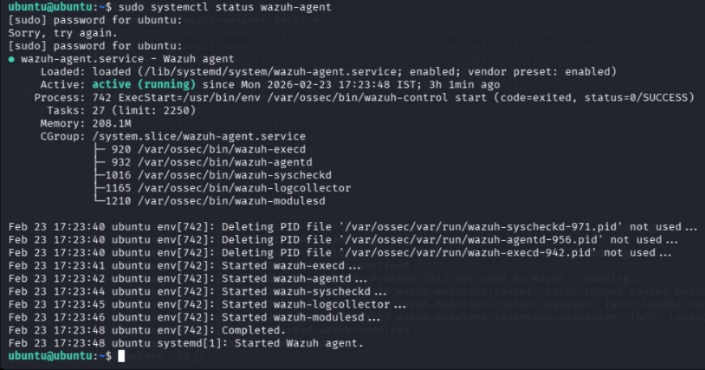
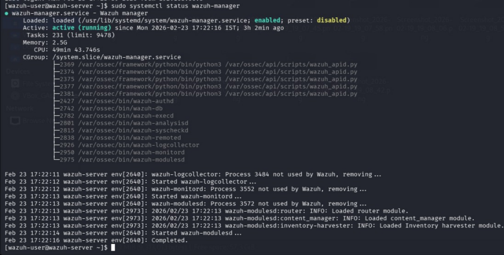
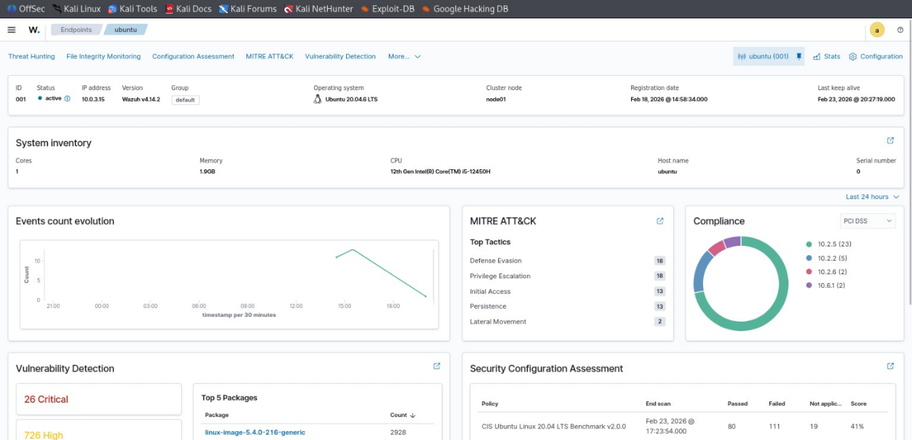
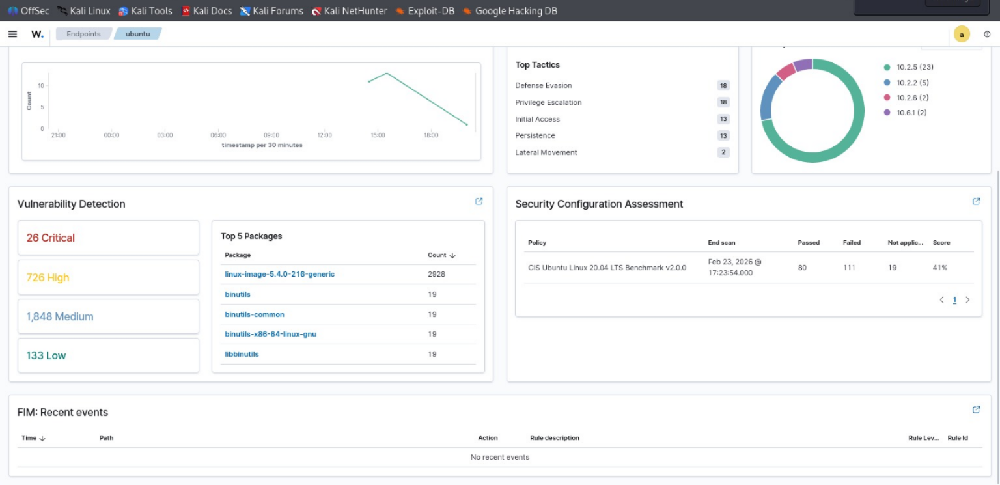
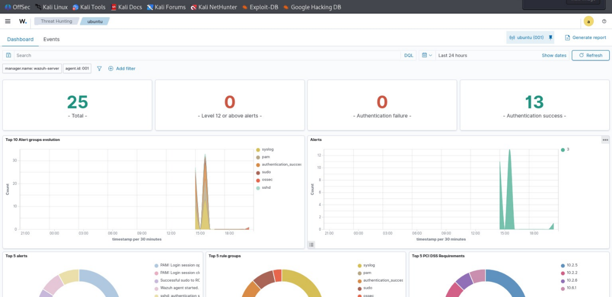
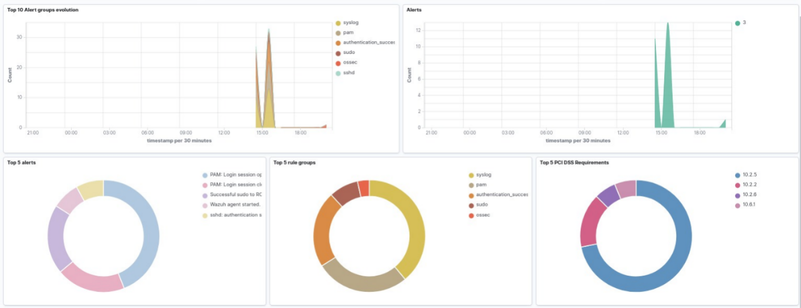
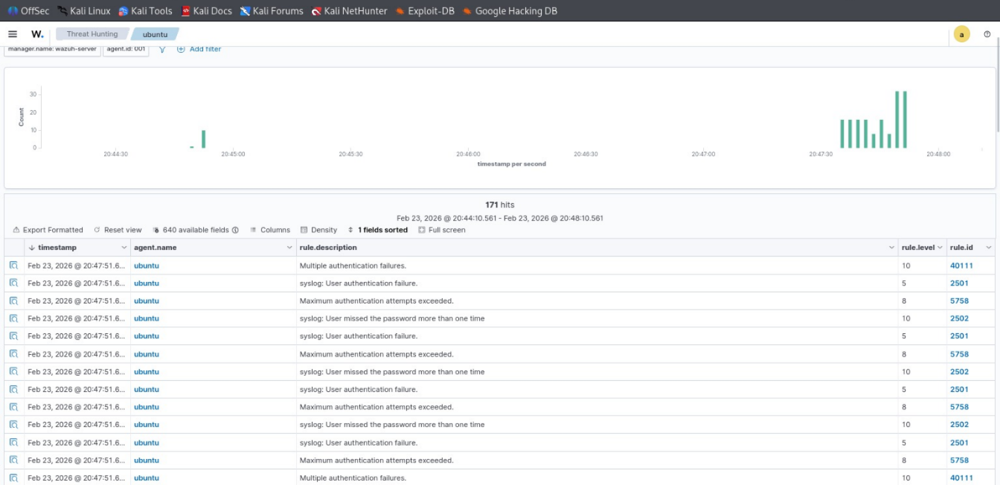
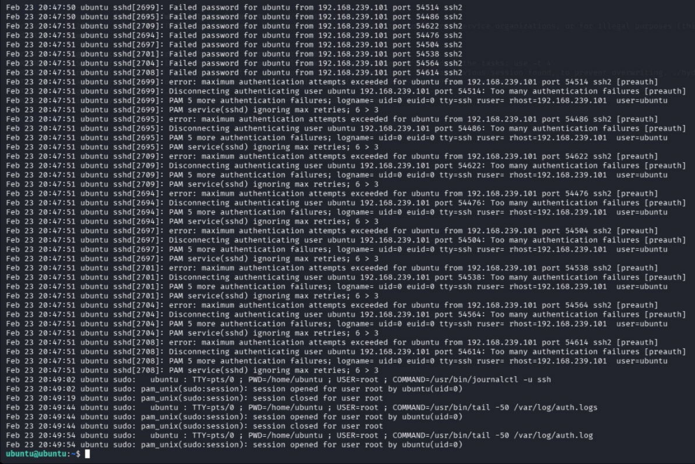

# SIEM Validation – Wazuh Infrastructure Verification

---

## 1. Purpose

The purpose of this phase is to validate that the **Wazuh SIEM infrastructure** is fully operational before initiating attack simulations.

This step ensures that:

* Logs are successfully collected from endpoints
* Events are properly processed by the SIEM
* Detection mechanisms are active
* Alerts can be generated for suspicious activity

Validating SIEM functionality prior to testing is a **standard practice in Security Operations Centers (SOC)** to ensure reliability of monitoring and detection workflows.

---

## 2. Wazuh Manager Service Validation

The Wazuh manager service was verified to ensure it is running correctly and operating without errors.

The manager is responsible for:

* Receiving logs from agents
* Analyzing events using detection rules
* Generating alerts based on suspicious activity

A healthy manager service confirms that the **core detection engine is active**.

### Validation Result

The service status confirmed that:

* Wazuh manager is active
* No critical errors are present
* The SIEM backend is functioning correctly

---

## 3. Agent Connectivity Validation

The Ubuntu endpoint was validated to ensure the **Wazuh agent** is properly installed, running, and connected to the manager.

The agent is responsible for:

* Collecting system and security logs
* Forwarding logs to the Wazuh manager
* Enabling endpoint-level monitoring

### Validation Result

* Agent service is active
* Communication with the manager is successful
* Endpoint monitoring is operational

---

## 4. End-to-End Log Flow Verification

To confirm complete SIEM functionality, log flow was validated across the pipeline:

1. Log generation on the endpoint (Ubuntu)
2. Log collection by Wazuh agent
3. Log forwarding to Wazuh manager
4. Event processing and indexing
5. Visualization in the Wazuh dashboard

This step ensures that the **entire data pipeline is functioning correctly**.

---

## 5. SIEM Operational Status

The SIEM environment is confirmed to be fully operational with the following components:

* Active Wazuh manager service
* Successfully connected endpoint agent
* Functional log collection and forwarding
* Detection engine ready for rule processing

The environment is now prepared for **attack simulation and monitoring**.

---

## 6. Troubleshooting Experience

During the setup process, several practical issues were encountered and resolved, reflecting real-world SOC challenges.

### Issues Encountered

* Incorrect server configuration
* Permission-related errors
* Service startup failures
* Agent registration conflicts
* Time synchronization issues

### Resolution Approach

* Reviewed and corrected configuration files
* Adjusted system permissions
* Restarted and validated services
* Re-registered agents with the manager
* Synchronized system time across machines

This process demonstrates **hands-on troubleshooting and operational debugging skills** in a SIEM environment.

---

## 7. Evidence Collection

Screenshots were captured to validate successful SIEM setup and operation.

### Evidence Includes

* Wazuh manager service status
* Wazuh agent status on endpoint
* Dashboard overview and alerts interface
* Log ingestion and event visibility

> **Note:** Ensure all images are stored within the repository and referenced using relative paths.

---

## 8. Conclusion

This phase confirms that the **Wazuh SIEM infrastructure is fully functional and stable**.

* Monitoring pipeline is validated
* Log ingestion is working correctly
* Detection engine is operational

With SIEM validation complete, the lab is ready to proceed to:

* Attack surface discovery
* Attack simulation
* Detection engineering

---

## 9. Supporting Evidence

=>Wazuh Agent Status

=>Wazuh Manager Status

=>Wazuh Dashboard

=>Wazuh Dashboard

=>Wazuh Dashboard

=>Wazuh Dashboard

=>Wazuh Logs

=>Agent Logs

---
