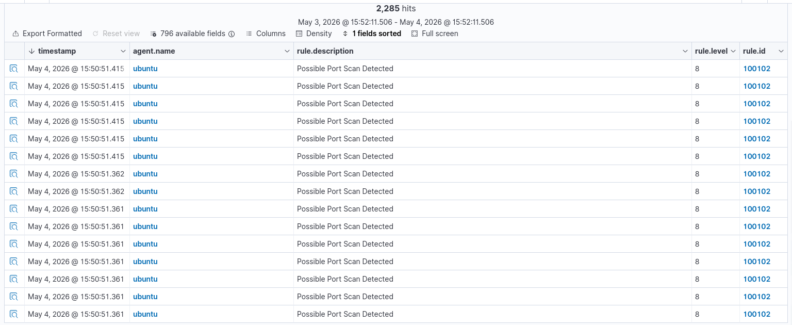
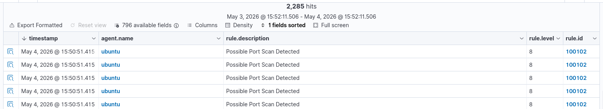

# SIEM Detection – Network Reconnaissance (Nmap) Alert Validation

---

## 1. Overview

This phase validates the SIEM platform’s ability to detect reconnaissance activity generated through network scanning.

Reconnaissance detection is critical because it represents the **early stage of an attack lifecycle**, where attackers attempt to identify exposed services and potential entry points.

---

## 2. Objective

The objective of this phase is to:

* Validate detection of network scanning activity
* Analyze how reconnaissance appears in SIEM alerts
* Evaluate detection accuracy and classification
* Identify limitations in default detection logic

---

## 3. Detection Scenario

During the attack simulation phase:

* An Nmap scan was executed from the attacker machine
* The Ubuntu target system received multiple connection attempts across ports
* System and network logs were generated (`/var/log/syslog`, UFW logs)

These logs were forwarded to the Wazuh manager for analysis.

---

## 4. Detection Method

Detection was performed using the Wazuh Dashboard by filtering alerts related to scanning activity.

### Query Used

```text id="b8t4zn"
agent.name: ubuntu AND rule.id: 100102
```

### Query Explanation

* `agent.name: ubuntu` → Filters events from the monitored endpoint
* `rule.id: 100102` → Custom rule for detecting port scanning behavior

This query isolates reconnaissance-related alerts for analysis.

---

## 5. Detection Results

The SIEM platform generated alerts indicating:

* Multiple connection attempts from a single source IP
* Sequential probing of network ports
* High-frequency activity within a short time window

Alert details included:

* Source IP address (attacker machine)
* Target system (Ubuntu)
* Rule ID and severity level
* Event timestamps

---

## 6. Alert Analysis

The alerts demonstrate clear indicators of reconnaissance behavior:

* Pattern-based port scanning
* Repeated connection attempts
* Enumeration of exposed services

These characteristics align with typical Nmap scanning activity.

---

## 7. Rule Details

* **Rule ID:** 100102
* **Description:** Port scanning / reconnaissance activity detected
* **Detection Logic:**

  * Multiple connection attempts from a single source IP
  * Access across multiple ports within a defined timeframe

This rule was implemented as part of custom detection engineering.

---

## 8. Detection Observations

During analysis, it was observed that:

* Network scanning activity was successfully detected
* Alerts were generated based on behavioral patterns rather than explicit tool identification
* Detection relied on frequency and distribution of connection attempts

This confirms that the SIEM detects **behavior, not tools**.

---

## 9. Detection Limitations

An important observation:

* Some non-scan activities (e.g., reverse shell attempts) were also classified under this rule

This indicates:

* Overlapping behavior patterns
* Potential for false positives
* Need for refined detection logic

This insight highlights the importance of **continuous detection tuning**.

---

## 10. Security Significance

Detecting reconnaissance activity is essential because:

* It provides early warning of potential attacks
* It allows defenders to act before exploitation occurs
* It reduces the attacker's ability to map the environment

Early-stage detection significantly improves defensive posture.

---

## 11. Detection Validation

This phase confirms that:

* Network activity logs are successfully analyzed
* Custom detection rules are functioning correctly
* The SIEM can identify reconnaissance behavior

This validates the SIEM’s ability to detect **pre-attack activity**.

---

## 12. Evidence Collection

Screenshots were captured to demonstrate:

* Wazuh alerts for rule ID 100102
* Query results showing reconnaissance activity
* Supporting system and firewall logs

> **Note:** Store all images inside the repository and reference them using relative paths.

---

## 13. Conclusion

This phase confirms that the SIEM platform successfully detects network reconnaissance activity using custom detection rules.

The results demonstrate:

* Effective identification of scanning behavior
* Behavioral-based detection capability
* Awareness of detection limitations

This phase strengthens the lab’s ability to detect attacks **before exploitation occurs**.

---

## 14. Supporting Evidence

=>Recon Detection Logs


=>Recon Detection Log


---
