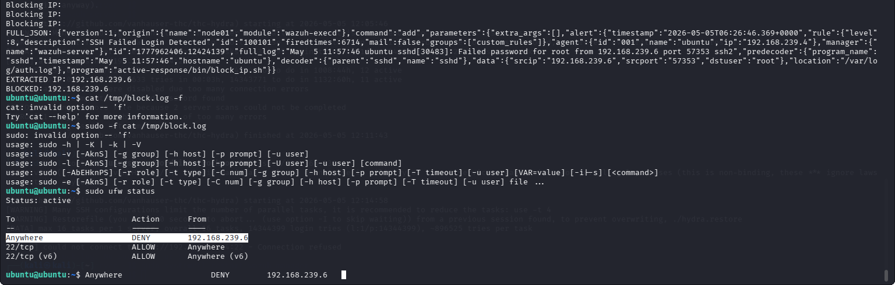
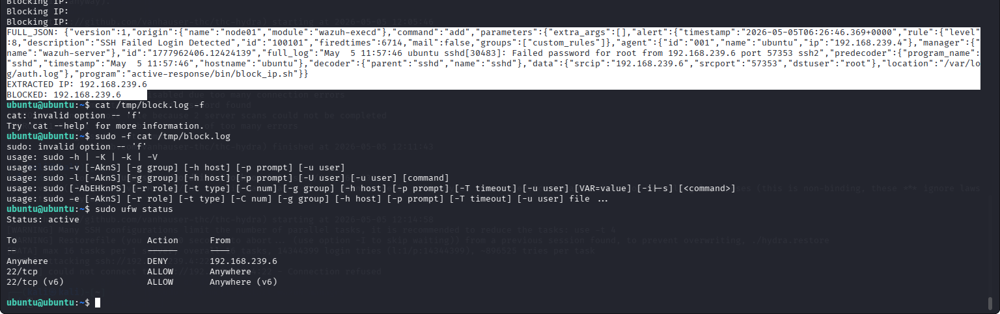

# Incident Response – Command Execution (Reverse Shell) Analysis

---

## 1. Overview

This phase focuses on analyzing the response to command execution activity, specifically reverse shell behavior.

Unlike brute force and reconnaissance attacks, execution-level attacks represent a **post-exploitation stage**, where the attacker attempts to gain interactive access to the system.

---

## 2. Objective

The objective of this phase is to:

* Evaluate response to reverse shell activity
* Identify gaps in automated mitigation
* Analyze limitations in detection and response
* Propose improvements for stronger defense

---

## 3. Incident Scenario

During the attack simulation:

* A reverse shell attempt was executed from the Ubuntu system
* The command attempted to establish a connection to the attacker machine
* Network activity was generated and logged

However:

* The activity was **misclassified as port scanning (Rule 100102)**
* No dedicated execution alert was triggered

---

## 4. Response Observation

Unlike previous attacks:

* No automatic IP blocking was consistently triggered
* The system did not apply a clear mitigation action
* The response phase was incomplete

---

## 5. Root Cause Analysis

### Detection Issue

```text id="root1"
Reverse shell activity was not correctly classified as execution behavior
```

### Response Dependency

* Active response depends on correct rule triggering
* Since classification was incorrect, response logic was not applied

---

## 6. Security Impact

This gap introduces risk:

* Attackers may establish remote shells
* Commands can be executed without detection
* System compromise may go unnoticed

---

## 7. Why Response Failed

The failure is due to:

* Detection based only on network behavior
* Lack of process-level monitoring
* Absence of dedicated reverse shell detection rules

---

## 8. Improvement Strategy

To enhance response capability:

### Detection Improvements

* Create custom execution detection rules (Rule 100103)
* Monitor shell execution processes
* Correlate network + process activity

---

### Response Improvements

* Trigger active response on execution rule
* Automatically block suspicious outbound connections
* Kill malicious processes if detected

---

## 9. Recommended Enhancements

* Enable process monitoring in Wazuh
* Add rules for suspicious command execution
* Correlate logs across multiple sources
* Implement layered detection strategy

---

## 10. Detection Insight

```text id="insight2"
Detection accuracy directly impacts response effectiveness
```

---

## 11. Validation Outcome

This phase confirms:

* Detection partially worked (activity observed)
* Classification failed (incorrect rule triggered)
* Response was not properly executed

This reflects a **real-world SOC challenge**.

---

## 12. Evidence Collection

Screenshots were captured showing:

* Reverse shell command execution
* Wazuh alerts (Rule 100102)
* System logs related to connection attempts

---

## 13. Conclusion

This phase highlights the limitations of the current detection and response system.

The results show:

* Incomplete response to execution-stage attacks
* Need for improved detection engineering
* Importance of accurate classification

This demonstrates advanced understanding of **security monitoring challenges**.

---

## 14. Key Takeaway

```text id="final1"
A SIEM is only as strong as its detection logic and rule design
```

---

## 15. Supporting Evidence

=>Execution Logs


=>Reverse Shell Attempt


---
