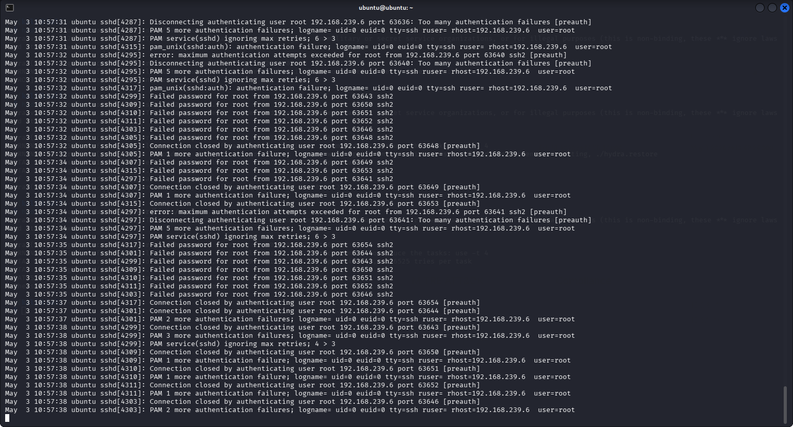
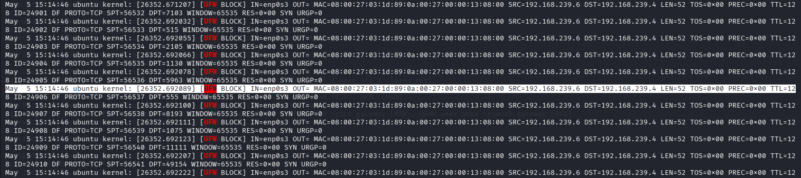

# Incident Response – Network Reconnaissance (Nmap) Mitigation

---

## 1. Overview

This phase focuses on responding to detected network reconnaissance activity, specifically port scanning behavior.

Reconnaissance represents the **initial stage of an attack**, and timely response is essential to prevent further exploitation.

---

## 2. Objective

The objective of this phase is to:

* Detect and respond to port scanning activity
* Block malicious scanning sources
* Validate automated response mechanisms
* Demonstrate early-stage attack mitigation

---

## 3. Incident Scenario

During the attack simulation:

* A network scan was performed using Nmap from the attacker machine
* The Ubuntu system received multiple connection attempts across ports
* The SIEM platform detected this activity under **Rule ID 100102**

The attacker IP was identified as:

```text id="attacker1"
192.168.239.6
```

---

## 4. Response Strategy

To mitigate reconnaissance activity:

* Automated response was configured via Wazuh
* A custom blocking script was triggered upon detection
* The system firewall (UFW) was used to deny access

---

## 5. Response Implementation

### Firewall Action

```bash id="cmd10"
sudo ufw deny from <attacker_ip>
```

This command blocks all incoming traffic from the attacker.

---

## 6. Execution Flow

1. Port scan activity is detected (Rule 100102)
2. Wazuh triggers active response
3. Attacker IP is extracted
4. Firewall rule is applied
5. Further scanning attempts are blocked

---

## 7. Validation Steps

### Step 1 – Check Firewall Rules

```bash id="cmd11"
sudo ufw status verbose
```

---

### Step 2 – Verify Block Entry

Expected output:

```text id="out1"
DENY IN    192.168.239.6
```

---

### Step 3 – Monitor Firewall Logs

```bash id="cmd12"
sudo tail -f /var/log/syslog | grep UFW
```

---

## 8. Observed Results

* The attacker IP was successfully blocked
* UFW logs confirmed dropped packets from the scanning source
* Continued scan attempts were denied

This demonstrates effective mitigation of reconnaissance activity.

---

## 9. Security Impact

This response:

* Stops attacker reconnaissance at an early stage
* Prevents service enumeration
* Reduces exposure of system information

---

## 10. Response Effectiveness

The system successfully:

* Detected scanning behavior
* Triggered automated blocking
* Prevented further probing activity

This confirms effective early-stage defense.

---

## 11. Limitations

* Detection is behavior-based and may trigger false positives
* IP-based blocking can be bypassed using different sources
* Advanced scans (slow scans) may evade detection

---

## 12. Evidence Collection

Screenshots were captured showing:

* Nmap scan execution
* Wazuh alerts (Rule 100102)
* UFW block entries and logs

---

## 13. Conclusion

This phase demonstrates successful response to reconnaissance activity using automated firewall enforcement.

The results confirm:

* Early detection and mitigation
* Effective use of active response
* Strengthened defensive posture

---

## 14. Supporting Evidence

=>Recon Response


=>UFW Logs


---
