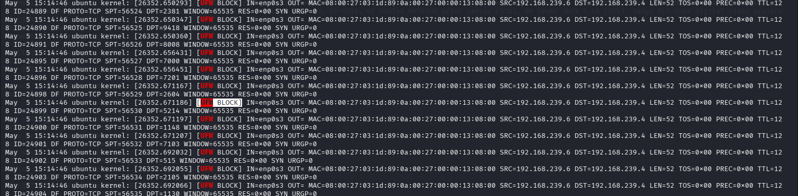
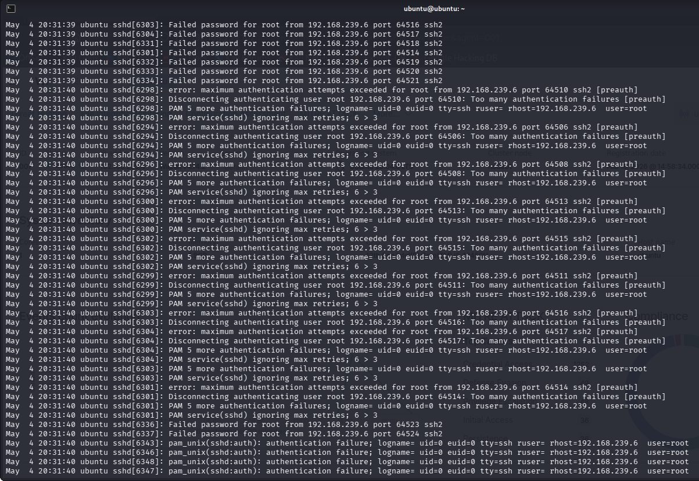

# Incident Response – SSH Brute Force Attack Mitigation

---

## 1. Overview

This phase focuses on responding to a detected SSH brute force attack by implementing automated defensive actions.

Incident response ensures that once malicious activity is detected, appropriate measures are taken to **contain and mitigate the threat**.

---

## 2. Objective

The objective of this phase is to:

* Automatically block attacker IP addresses
* Prevent further unauthorized access attempts
* Validate active response functionality in Wazuh
* Demonstrate real-time threat mitigation

---

## 3. Incident Scenario

During the attack simulation:

* Multiple failed SSH login attempts were generated
* The SIEM platform detected brute force activity
* The attacker IP was identified as **192.168.239.6**

---

## 4. Response Strategy

To mitigate the attack:

* An active response mechanism was configured
* A custom script was used to block the attacker IP
* The system firewall (UFW) was used to enforce the block

---

## 5. Response Implementation

### Active Response Script

A custom script (`block_ip.sh`) was used to:

* Extract the source IP from alert data
* Apply a firewall rule to block the attacker

---

### Example Action

```bash
sudo ufw deny from <attacker_ip>
```

---

## 6. Execution Flow

1. Brute force attack is detected (Rule 100001)
2. Wazuh triggers active response
3. Script extracts attacker IP
4. UFW rule is applied
5. Attacker is blocked

---

## 7. Validation Steps

### Step 1 – Check Firewall Status

```bash
sudo ufw status
```

---

### Step 2 – Verify Blocked IP

Expected output:

```text
DENY    192.168.239.6
```

---

### Step 3 – Check Active Response Logs

```bash
sudo cat /var/ossec/logs/active-responses.log
```

---

## 8. Observed Results

* Attacker IP was successfully blocked
* SSH connection attempts were interrupted
* Logs confirmed execution of firewall rules

This demonstrates effective automated response.

---

## 9. Security Impact

This response:

* Prevents continued brute force attempts
* Reduces risk of credential compromise
* Enhances system resilience

---

## 10. Response Effectiveness

The response mechanism successfully:

* Detected the attack
* Triggered automated defense
* Blocked the attacker in real time

This confirms proper integration of detection and response.

---

## 11. Limitations

* Blocking is IP-based and may be bypassed using different IPs
* Over-aggressive blocking may impact legitimate users
* Requires tuning for production environments

---

## 12. Evidence Collection

Screenshots were captured showing:

* UFW blocked IP entry
* Active response logs
* Interrupted SSH connection attempts

---

## 13. Conclusion

This phase demonstrates successful implementation of automated incident response for brute force attacks.

The results confirm:

* Effective detection-response integration
* Real-time threat mitigation
* Practical SOC response capability

---

## 14. Supporting Evidence

=>UFW Block


=>Active Response Logs


---
